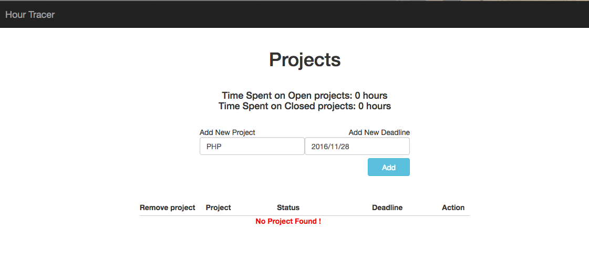
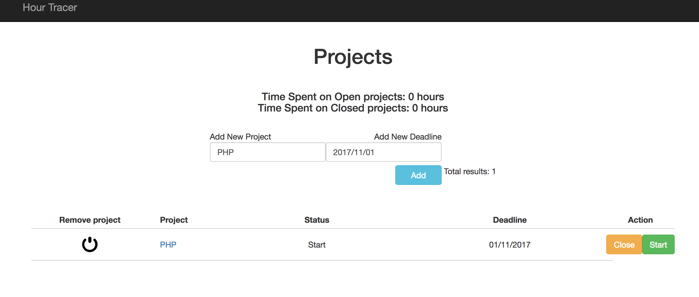
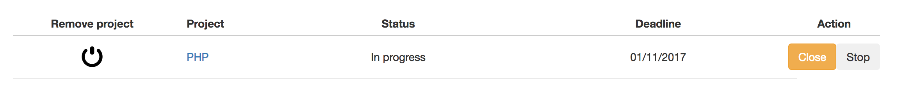
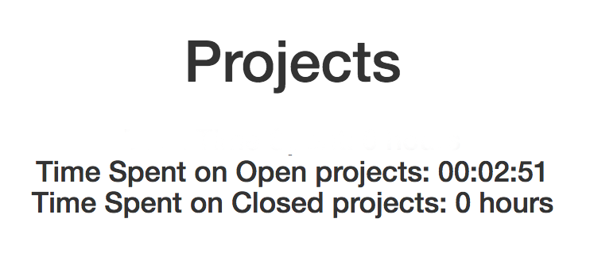
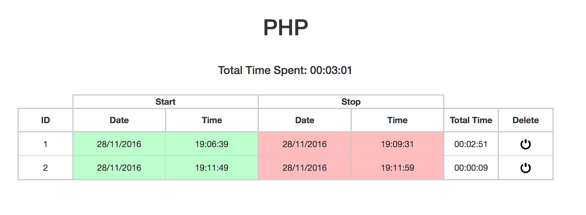

# Bob's Hour Tracer

---


## Introduction


**Hour Tracer** is a web application intended for a freelencer which wants to track the time of his own work.

## User Case


**Bob is a freelancer** that wants to keep track of how much time he spends working on different projects. At any given time he is working on several different projects, giving each of them a unique name. He needs to be able to log the date, the time he starts, and the time he stops working on a project, so that he knows how many hours in total he has spent on it. He needs to be able to start and stop the same project multiple times. For a GUI, Bob does not need much, but he must be able to see an overview of the time spent on his projects, create new projects, and add entries to existing ones.

## The Application


**Hour Tracer** web application is built using both ```Back-End``` and ```Front-End``` languages.
#### Back-End:
      * PHP
      * PostgreSQL (Database)

Example of ajax.php the case add project action:

  ```php
  <?php
  	case "add_project":
	 $_GET['name'] = rtrim(ltrim($_GET['name']));
	 $_GET['deadline'] = rtrim(ltrim($_GET['deadline'])); // be carefull here it may cause security

	 $result = pg_query( $db, "SELECT name FROM project_details WHERE name = '".$_GET['name']."'"); //check if project_details name already exists

	if(pg_num_rows($result)) { //if yes
        $projectName = "Project already exists !"; //show project_details already exists
			} else { //if no
				$insert = pg_query($db, "INSERT INTO project_details (NAME,deadline,STATUS) VALUES ('".$_GET['name']."','".$_GET['deadline']."',1)"); //Add new project_details
				$res = pg_query($db, "SELECT id, name,'Start' as status ,deadline FROM project_details ORDER BY ID DESC LIMIT 1"); // Get ID of this inserted row

				while($row =pg_fetch_array($res)){
					// $data[$row['id']] = $row;
					$id = $row['id'];
					$name = $row['name'];
					$status = $row['status'];
					$deadline = $row['deadline'];
				}
				echo $id."|".$name ."|".$status ."|".$deadline; // send back the name, id and the deadline to the homepage to add the project_details to the table
			}

			break;
  ?>
  ```

#### Front-End:
      * HTML
      * CSS
      * Javascript / Jquery / Ajax
      * Bootstrap

Example of main.js ajax call add project:

```javascript
	function addProject() { //send request to ajax.php to add new project and add it to the table
    var name = $('#newproject').val();
    var deadline = $('#newprojectdeadline').val();
    if (name.trim()) {
        $.ajax({
            url: "ajax.php?action=add_project&name=" + name + "&deadline=" + deadline,
            success: function(result) {
              if(result){ // Project name not exist so success add new
                //console.log("Great!!!")
                {
                  $(".success").css("color","green").show();
                  $(".error").hide();
                  $('#newproject').val('');
                }
                  window.location.reload();
              }else{ // Project name exist so erro show error
                //console.log("Error!!!")
                {
                  $(".error").css("color","red").show();
                  $(".success").hide();
                }
              }

            }
        });
    }
}
```
#### The structure of the application is as following:

```
|- /                            # Root - Readme, Index and View
|
|-- /app/  						# Main functionality
|                      
|-- /public/ 					# Assets of the project
|  |- css/
|  |- fonts/
|  |- img/
|  |- js/

```
## PostgreSQL


**The Database** contains 4 tables
	
	- project_details			
	- project_status
	- project_task_details
	- project_tim 

#### Tables structure:

An example how the **PostgreSQL** is working

**PostgreSQL example of how to create a new database and new table**

	CREATE DATABASE name
	[ [ WITH ] [ OWNER [=] db_owner ]
	[ TEMPLATE [=] template ]
	[ ENCODING [=] encoding ]
	[ TABLESPACE [=] tablespace ] ]
	// --------------------- //
	CREATE TABLE project_details (
    id integer NOT NULL,
    name character varying(75) NOT NULL,
    deadline date NOT NULL,
    status integer DEFAULT 1 NOT NULL,
    total_time time without time zone
	);

**Project Details Table**

| ID [PK]       | Name          | Deadline      |Status |Total_time|                
| ------------- | ------------- |---------------|-------|----------|
| 1             | PHP           |  30-11-2017   | Start | 1:02:30  |
| 2             | Ruby          |	  30-11-1017   | Closed| 00:30:00 |

**Project Status Table**

| ID [PK]       | Name          |
| ------------- | ------------- |
| 1             | Start         |
| 2             | In progress   |
| 3             | Closed        |


## How To...

#### Tools you need:


  * A localhost client to run Apache server like MAMP/WAMP/XAMPP/LAMP
  * PostgreSQL installed on your machine or a client like    [Postgresapp](http://postgresapp.com/)
  * Terminal for the PSQL interaction or a GUI like [pgAdmin](https://www.pgadmin.org/)
  * A code editor of your choice like [Atom](https://atom.io/) or [SublimeText](https://www.sublimetext.com/)
<br>

After you downloaded and installed all the tools, you are ready to proceed with the set up of the **Hour Tracer** Application

#### Make the app ready to run


**Setup the local enviroment - The easy way:**


- Clone the repository or download the zip (Un-Zip) inside the folder ```htdocs``` of your localhost client, should look like ```/htdocs/HourTracer/...```

- Set up the **Database**. Go to the root **/** of the project and look for the file called ```hourTracer.sql```. You have to import the dump inside your **pgAdmin**. Inside the GUI you have to create a new DB and import inside the sql dump. Please refer to the documentation of [pgAdmin](https://www.pgadmin.org/docs4/dev/index.html) or watch a [tutorial](https://www.youtube.com/watch?v=nPbceHIPh4Y)

- At this point you're almost done and you need to set up the last but important thing, **the connection to the db**. You have to go to the next file ```/htdocs/HourTracer/db_connect.php``` and change the fields inside to match your parameters. See the example below:

  ```php
      <?php
      //Database connection
      $db_host		  = "host=127.0.0.1";// localhost IP
      $db_port		  = "port=5432";// DB port of PostgreSQL
      $db_name		  = "dbname=hourtracer";// DB name
      $db_user		  = "user=postgres";// User you set up
      $db_password 	  = "password=";// Password to access the DB
      //This makes the connection
      $db = pg_connect("$db_host $db_port $db_name $db_user $db_password");
      //For check if the connection success
      if (!$db) {
         echo "Error : Unable to open database\n";
      } else {
         echo "Opened database successfully\n";
      }
      //This last is only for test the connection should be commented during the use of the app and in production
      ?>
  ```

- If you have done the steps before the right way, you should run your localhost client and point your URL to ```http://localhost/HourTracer/index.php``` and you should see the web application running

		PS: Pay attention to the use of MAMP,
		you should navigate with your browser to:
		http://localhost:8888/hourtracer/index.php
		If you use a different client please check the documentation
		related to the specific client if you get any issue running the application

**Setup the local enviroment - The advance way:**

Make a **Virtual Host** and point the web app to the URL ```hourtracer.dev```

- Use the first step of the **easy way** section or just make a new folder where you prefer. Rember also to import the database dump

- Add an additional host to your ```/etc/hosts``` file:

	```127.0.0.1 hourtracer.dev```

- Now you need to enable Virtual Hosts in your Apache configuration. You can find this file at "/Applications/MAMP/conf/apache/httpd.conf". Locate the lines that look like this in the file:

	```
	# Virtual Hosts
# Include /Applications/MAMP/conf/apache/extra/httpd-vhosts.conf <--
	```
Should looks:

	```
	# Virtual Hosts
Include /Applications/MAMP/conf/apache/extra/httpd-vhosts.conf <--
	```

- Now you need to set up a Virtual Host in Apache. To do this, you need to add some lines to another Apache configuration file. This file is located at "/Applications/MAMP/conf/apache/extra/httpd-vhosts.conf". Add these lines at the bottom:

	```
	<VirtualHost *:8888>
	    DocumentRoot "/Applications/MAMP/htdocs/hourtracer"
	    ServerName hourtracer.dev
	</VirtualHost>
	```
- Browse to ```http://hourtracer.dev:8888/``` to see the web application live.

## Bob's Hour Tracer User Guide

Now it is time to see how to use the application

#### Main view


The main view contains the general information about the time spent on the projects, the input fields to add a new project with the deadline and the table contains a single project review. 
To add a new project fill the input field with the title of your project and fill the date of the project's deadline. Then press add.



Here you see your new aded project with the name and the deadline. You can interact with the table doing the next operations:
 
- Clicking on the **remove project** symbol, you will **delete** your project

- Clicking the **name** of the project you will be redirect to a specific view of the project logs

- **Status** indicate if the project is **start**, **in progress** and **closed**

- **Deadline** expected date of project completion

- **Action** you can **close** a project when completed or **start/stop** the project (next fig shows started project)



When stop is clicked the time is updated in the main view



		* Time Spent on Open projects -> Updated when a started project is stopped
		* Time Spent on Close projects-> Updated when a project it is closed 

#### Project logs view


Here you can see all the logs of the current project. 


